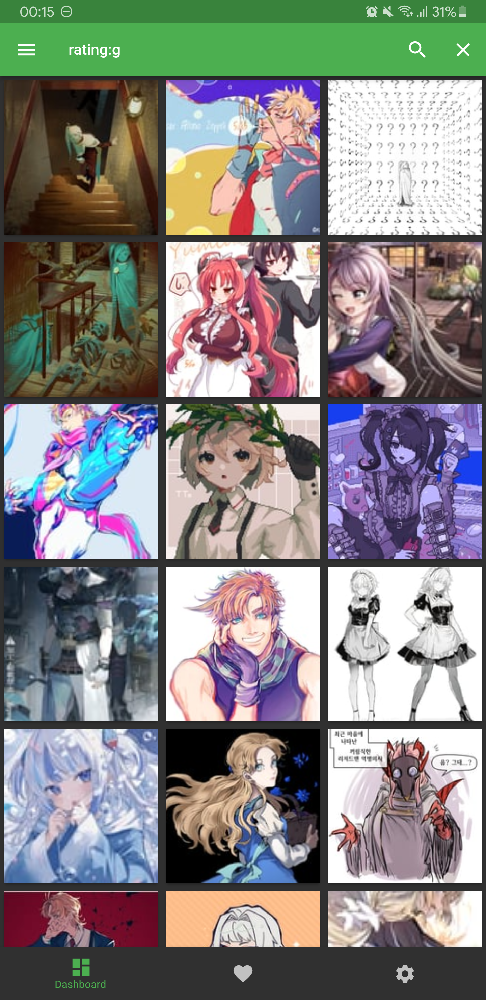
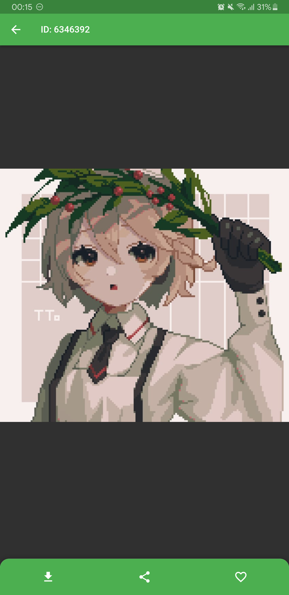
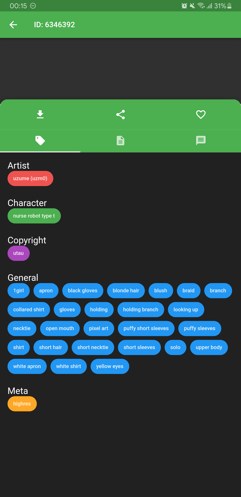

<div align="center">
    </img>
</div>
<h1 align="center">Ibuki</h1>
<p align="center">An ultimate, fully customizable Booru browser app. Now on your phone.</p>
<div align="center">
    </img>
    </img>
    </img>
</div>

---
## What is the difference?
Unlike all the Booru applications out there where developer decided beforehand which Boorus are available to user, **Ibuki** is highly customizable. You can yourself add whatever Booru out there to the **Ibuki** and it will display pictures from that Booru and retain full functionality (as long that Booru has a public REST API, of course). The application consumes a script file that has only one purpose - connect to the Booru API and return objects so even you with a bit of time can grab a Booru from *booru.org* and create a wrapper script for its API.

---
## Contribution
You are free to make any pull requests and code changes you want (as long it's within the licence), but keep in mind, that I'm working solo on this project in my spare time, so it would take a lot of time for me to review all the pull requests out there.

## License
```
Copyright 2023 Night Sky Studio (Konstantin Romanets)

Licensed under the Apache License, Version 2.0 (the "License");
you may not use this file except in compliance with the License.
You may obtain a copy of the License at

    http://www.apache.org/licenses/LICENSE-2.0

Unless required by applicable law or agreed to in writing, software
distributed under the License is distributed on an "AS IS" BASIS,
WITHOUT WARRANTIES OR CONDITIONS OF ANY KIND, either express or implied.
See the License for the specific language governing permissions and
limitations under the License.
```
